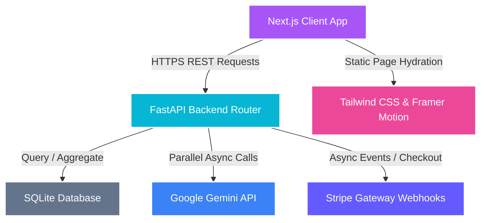

<div align="center">
  

  # 🔮 ContentAlchemy

  ### **Turn a single manuscript, blog post, or transcript into 10+ high-engagement social formats instantly.**

  [](https://nextjs.org/)
  [](https://fastapi.tiangolo.com/)
  [](https://deepmind.google/technologies/gemini/)
  [](https://stripe.com/)
  [](https://opensource.org/licenses/MIT)

  <p align="center">
    <a href="#-key-features">Key Features</a> •
    <a href="#%EF%B8%8F-architecture--data-flow">Architecture</a> •
    <a href="#-installation--setup">Installation & Setup</a> •
    <a href="#%EF%B8%8F-deployment">Deployment</a> •
    <a href="#-contributing">Contributing</a>
  </p>
</div>

---

**ContentAlchemy** is a premium, full-stack content repurposing workflow engine. Powered by Google's **Gemini API** and crafted with a state-of-the-art **glassmorphic UI**, it enables writers, creators, and marketing teams to scale their distribution across LinkedIn, X (Twitter), TikTok, Instagram, newsletters, and more with zero formatting friction. 

Say goodbye to manual reformatting. Paste your draft, select your formula, and watch your content multiply.

---

## ✨ Key Features

* **🎨 Award-Winning Glassmorphic UI**: High-fidelity dashboard built with HSL curated variables, subtle micro-animations, canvas ambient moving particle backdrops, and hardware-accelerated scroll tracking using Framer Motion.
* **📈 Live Telemetry Dashboard**: Visualizes user daily usage counts using a custom circular SVG progress ring. It tracks estimated hours/minutes saved dynamically (calculating 15m of effort saved per render).
* **⚡ Gemini Flash Integration**: Connected to `gemini-flash-latest` for low-latency, high-quality generation pipelines with smart fallback support.
* **📝 Quick Recipe Presets**: Immediate one-click templates ("Blog to Twitter Thread", "YouTube to LinkedIn Post", "Idea to Short Script") that auto-fill text area inputs and match target format configuration presets.
* **👀 Recent Creations Feed & Live Previews**: Browse and review recent generation archives. Features a premium preview modal to inspect generated platform outputs, copy specific items with click feedback, or download them as `.txt` files.
* **💳 Complete Stripe Subscription Integration**: Complete customer checkout session pipelines and real-time webhook update listeners for Free, Pro, and Max pricing tiers.
* **📊 Dual Viewport Layout**: Review your generation results in a responsive grid layout or run side-by-side brand voice comparisons in **Compare View**.

---

## ⚙️ Architecture & Data Flow



### Technology Stack
* **Frontend**: Next.js 15 (App Router, Turbopack), React 19, TypeScript 5, Tailwind CSS, Framer Motion, Zustand (state management), and Sonner (toast telemetry).
* **Backend**: FastAPI (Python), SQLAlchemy (async aiosqlite), Pydantic, and Uvicorn.
* **AI Engine**: Google GenAI SDK (configured for optimized `gemini-flash-latest`).
* **Payments**: Stripe SDK (asynchronous customer portal and checkout handlers).

---

## 📦 Directory Structure

```text
├── backend/                  # FastAPI Python backend
│   ├── app/
│   │   ├── api/routes/       # Auth, billing, library, and repurpose API endpoints
│   │   ├── core/             # Database connection, security, and global config
│   │   ├── models/           # SQLAlchemy ORM models (User, Generation)
│   │   ├── schemas/          # Pydantic validation schemas
│   │   └── services/         # Repurposing prompt templates and cache
│   └── requirements.txt      # Python package dependencies
│
└── frontend/                 # Next.js React frontend
    ├── src/
    │   ├── app/              # App router pages (dashboard, library, login/signup)
    │   ├── components/       # Custom components (InputPanel, Gauge, Background)
    │   └── lib/              # Client API methods, theme utils, and stores
    └── package.json          # Node dependencies and build scripts
```

---

## 🚀 Installation & Setup

Choose backend or frontend setup details below to get started locally:

<details>
<summary><b>🐍 Backend Local Setup</b></summary>

### Prerequisites
- Python 3.10+
- Pip package manager

### Steps
1. **Navigate to the backend folder**:
   ```bash
   cd backend
   ```

2. **Create and activate a Python virtual environment**:
   ```bash
   python -m venv venv
   source venv/bin/activate  # On Windows: venv\Scripts\activate
   ```

3. **Install dependencies**:
   ```bash
   pip install -r requirements.txt
   ```

4. **Set up Environment Variables**:
   Create a `.env` file in the `backend/` directory:
   ```env
   DATABASE_URL=sqlite+aiosqlite:///./contentalchemy.db
   GEMINI_API_KEY=your_gemini_api_key
   GEMINI_MODEL=gemini-flash-latest
   JWT_SECRET=your_super_secure_jwt_secret
   STRIPE_SECRET_KEY=your_stripe_secret_key
   STRIPE_WEBHOOK_SECRET=your_stripe_webhook_secret
   ```

5. **Start the FastAPI backend server**:
   ```bash
   python -m uvicorn app.main:app --reload --port 8000
   ```
   *Swagger docs will be available at `http://localhost:8000/docs`.*

</details>

<details>
<summary><b>⚛️ Frontend Local Setup</b></summary>

### Prerequisites
- Node.js 18+
- npm or yarn

### Steps
1. **Navigate to the frontend folder**:
   ```bash
   cd frontend
   ```

2. **Install npm dependencies**:
   ```bash
   npm install
   ```

3. **Set up Environment Variables**:
   Create a `.env.local` file in the `frontend/` directory:
   ```env
   NEXT_PUBLIC_API_URL=http://localhost:8000
   ```

4. **Start the Next.js development server**:
   ```bash
   npm run dev
   ```
   *The application will be running at `http://localhost:3000`.*

</details>

<details>
<summary><b>💳 Stripe Webhook Testing</b></summary>

To test the billing features and checkout flows locally, you'll need the Stripe CLI installed:

1. **Start forwarding events to your backend**:
   ```bash
   stripe listen --forward-to localhost:8000/api/billing/webhook
   ```
2. **Copy the signing secret** (starts with `whsec_`) printed in the terminal.
3. **Paste it into your backend `.env` file** under `STRIPE_WEBHOOK_SECRET`.
4. Restart your backend server.

</details>

---

## ☁️ Deployment

### Backend (FastAPI)
You can deploy the backend to platform-as-a-service providers like **Render**, **Railway**, or **Fly.io**:
- **Start Command**: `python -m uvicorn app.main:app --host 0.0.0.0 --port $PORT`
- **Database**: Ensure you use a persistent disk volume mount if using SQLite, or switch `DATABASE_URL` to a hosted PostgreSQL instance.
- **CORS Config**: Update the `origins` list in [main.py](file:///Users/anurag/Downloads/ContentAlchemy/backend/app/main.py) to include your frontend's production URL.

### Frontend (Next.js)
The frontend is optimized for **Netlify** or **Vercel**:
- **Base directory**: `frontend`
- **Build command**: `npm run build`
- **Publish directory**: `frontend/.next` (or default auto-detected Next.js build output)
- **Environment Variables**: Make sure to set `NEXT_PUBLIC_API_URL` to your production backend URL.

---

## 🤝 Contributing

Contributions make the open-source community an amazing place to learn, inspire, and create. Any contributions you make are **greatly appreciated**.

1. Fork the Project
2. Create your Feature Branch (`git checkout -b feature/AmazingFeature`)
3. Commit your Changes (`git commit -m 'Add some AmazingFeature'`)
4. Push to the Branch (`git push origin feature/AmazingFeature`)
5. Open a Pull Request

---

## 📄 License

Distributed under the MIT License. See `LICENSE` for more information.

---

<div align="center">
  <p>Built with 💜 by <a href="https://github.com/Greninja-2004">Greninja-2004</a></p>
</div>
